# 3. Construction
- [Découpe du bois](#d-coupe-du-bois)
  * [Liste de découpe du bois](#liste-de-d-coupe-du-bois)
  * [Détail par pièce](#d-tail-par-pi-ce)
    + [A - Side panel](#a---side-panel)
    + [B - Top panel](#b---top-panel)
    + [C - Marquee Bottom panel](#c---marquee-bottom-panel)
    + [D - Front panel](#d---front-panel)
    + [E - Monitor Support panel](#e---monitor-support-panel)
    + [F -Top Rear panel & door](#f--top-rear-panel---door)
    + [G - Bottom Rear panel](#g---bottom-rear-panel)
    + [H - Speakers panel](#h---speakers-panel)
    + [I - Front door](#i---front-door)
    + [J - Bottom panel](#j---bottom-panel)
    + [K - Control console](#k---control-console)
    + [N - Monitor console](#n---monitor-console)
    + [O - Door panel](#o---door-panel)
    + [P - Foot panel](#p---foot-panel)
- [Assemblage](#assemblage)

## Découpe du bois
### Liste de découpe du bois
| ID | Nom | Matériel | Quantité | Longueur | Largeur | Épaisseur | 
|:---:|:---:|:---:|:---:|:---:|:---:|:---:|
| A | Side panel | MDF | 2 | 1'666mm | 610mm | 19mm |
| B | Top panel | MDF | 1 | 270mm | 685mm | 19mm |
| C | Marquee Bottom panel | MDF | 1 | 210mm | 685mm | 19mm |
| D | Front panel | MDF | 1 | 115mm | 685mm | 19mm |
| E | Monitor Support panel | MDF | 1 | 83mm | 685mm | 19mm |
| F_1 F_2 | Top Rear panel Top Rear door | MDF | 1 | 179+355mm (ou) 534mm | 685mm | 19mm |
| G | Bottom Rear panel | MDF | 1 | 1'070mm | 685mm | 19mm |
| H | Speakers panel | MDF | 1 | 130mm | 685mm | 19mm |
| I | Front door | MDF | 1 | 658mm | 685mm | 19mm |
| J | Bottom panel | MDF | 1 | 490mm | 685mm | 19mm |
| K | Control console | MDF | 1 | 255mm | 685mm | 19mm |
| N | Monitor console | MDF | 1 | 471mm | 685mm | 19mm |
| O | Door panel | MDF | 1 | 116mm | 685mm | 19mm |
| P | Foot panel | MDF | 1 | 50mm | 685mm | 19mm |
| / | Tasseau | ??? | 9 | 20mm | 150mm | 20mm |
| / | Foot Strengther | ??? | 4 | 50mm | 50mm | 20mm |

> Note : Les pièces F_1 et F_2 peuvent être laissées ensemble si besoin.

> Note : Les pièces L et M n'existent plus dans la version actuelle du plan.

### Détail par pièce
#### A - Side panel
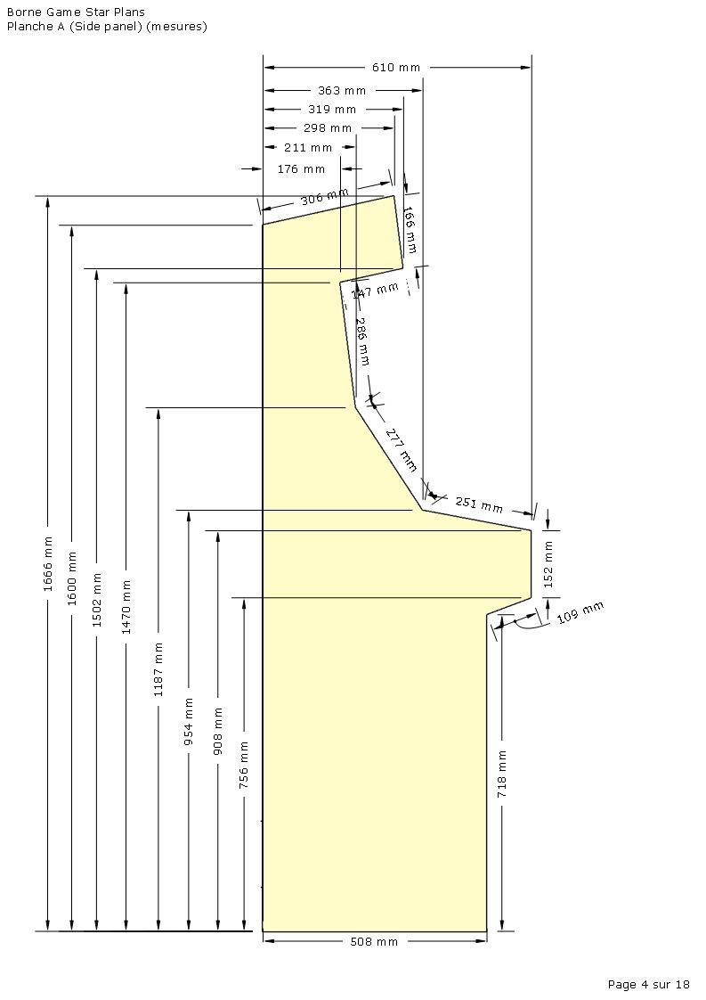

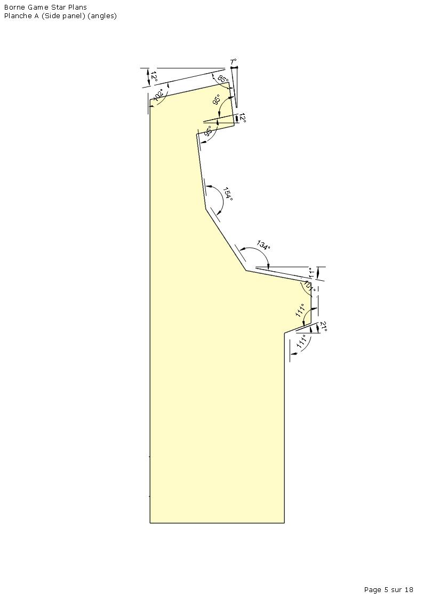

#### B - Top panel
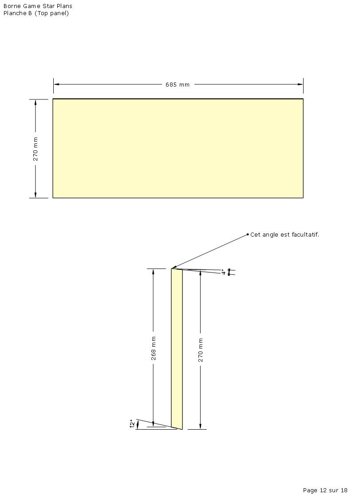

#### C - Marquee Bottom panel
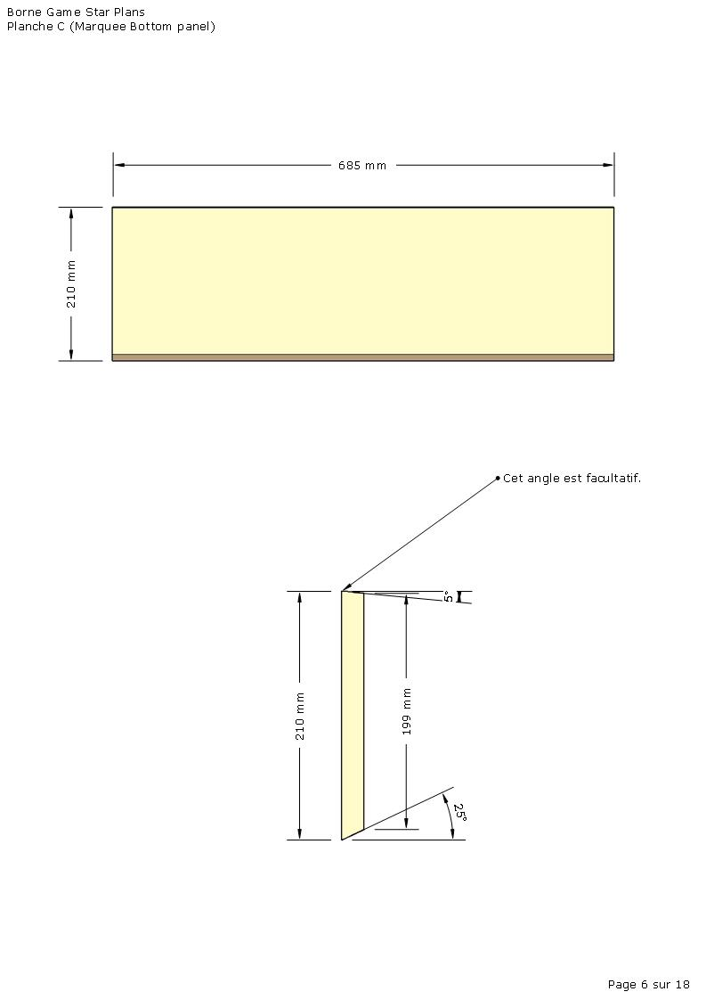

#### D - Front panel
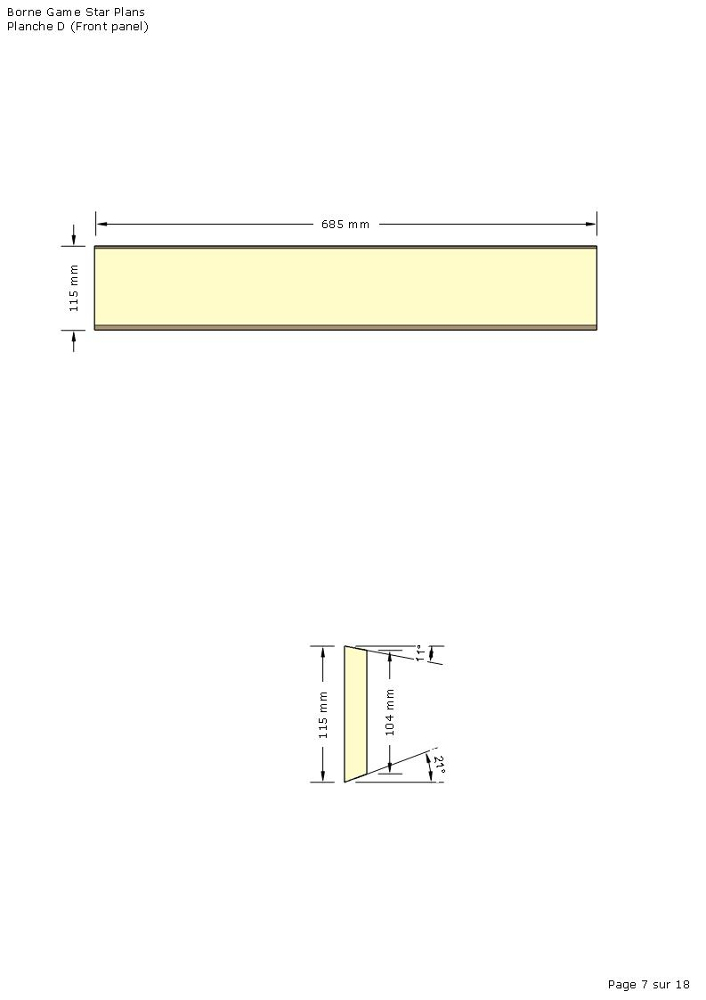

#### E - Monitor Support panel
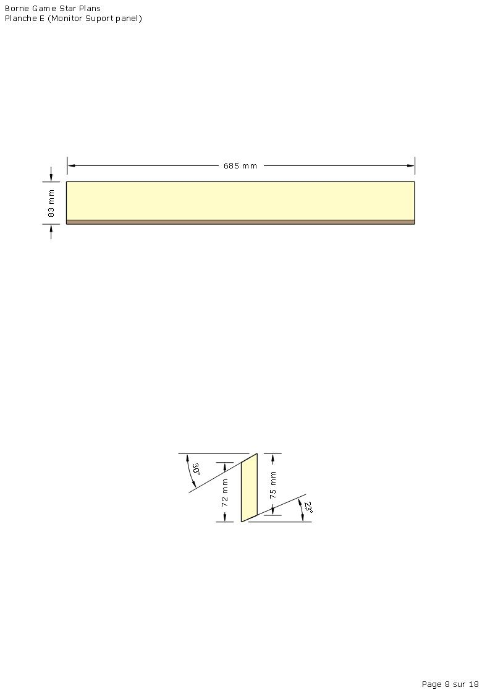

#### F -Top Rear panel & door
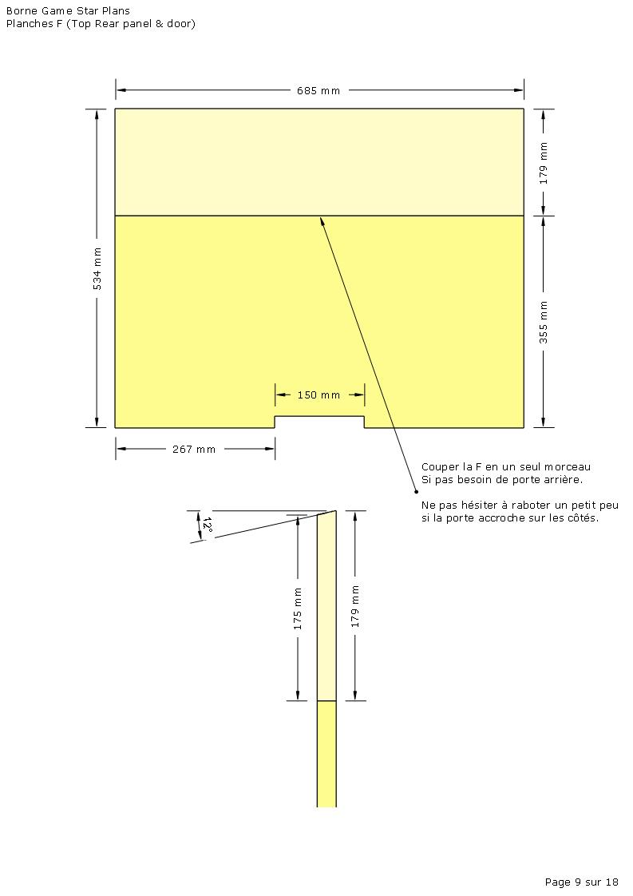

#### G - Bottom Rear panel
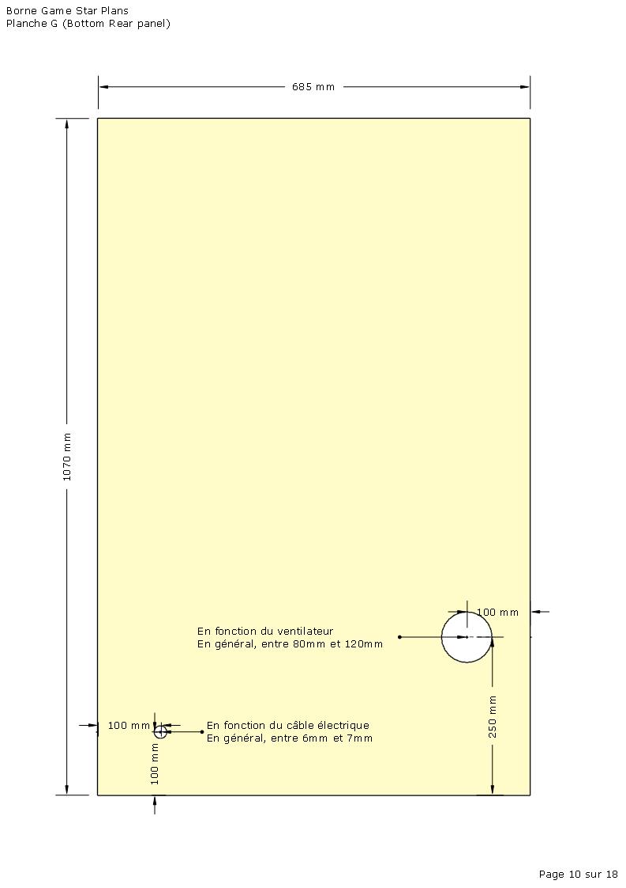

#### H - Speakers panel
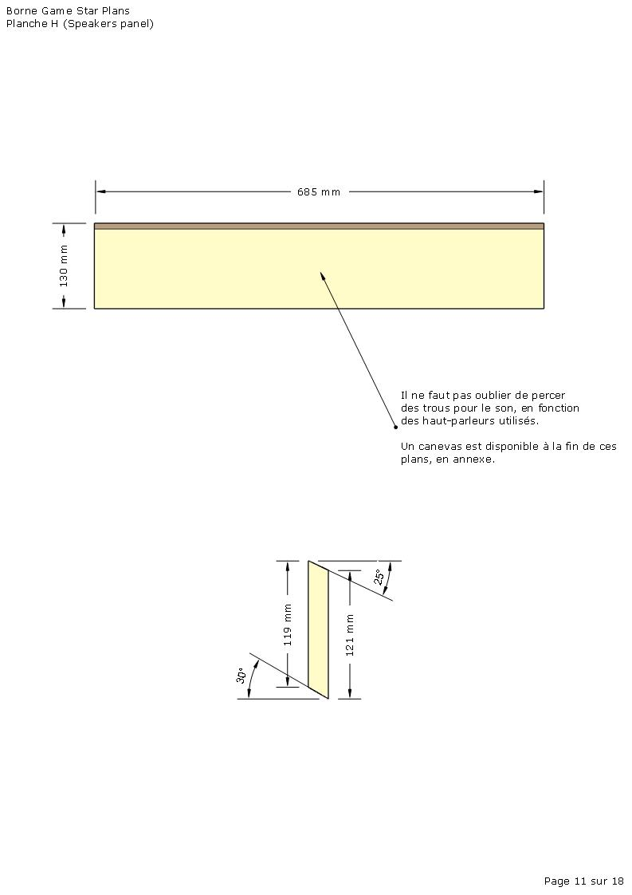

#### I - Front door
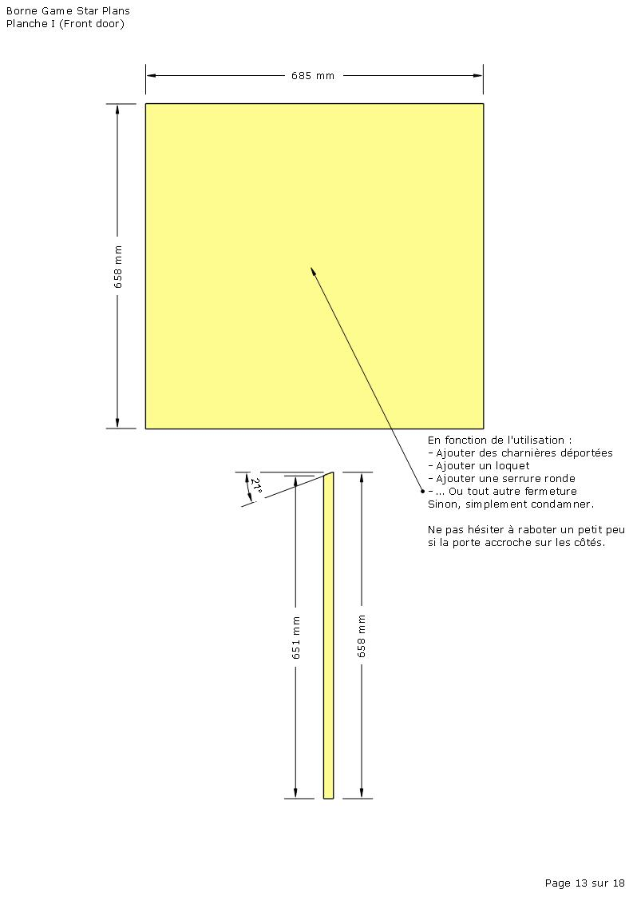

#### J - Bottom panel
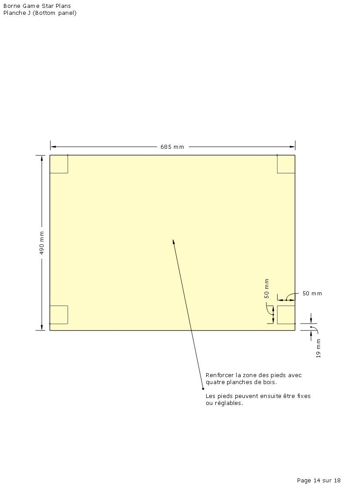

#### K - Control console
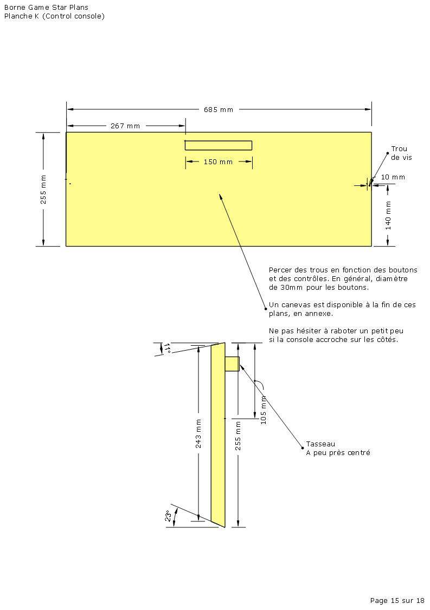

#### N - Monitor console

#### O - Door panel

#### P - Foot panel
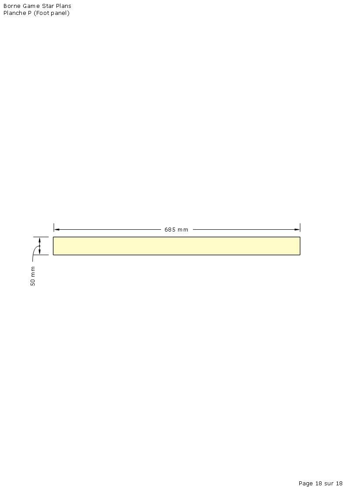

## Assemblage
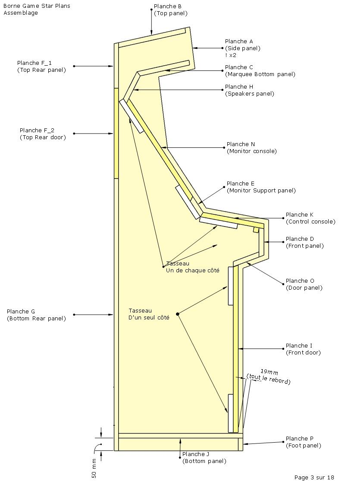